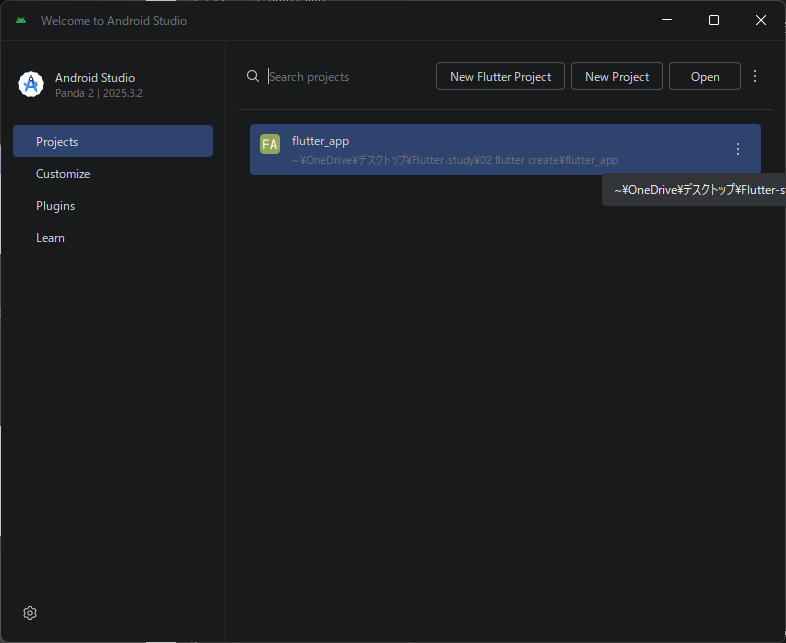
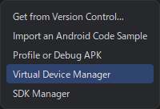

# Flutter プロジェクト作成〜実行メモ

---

## 1. プロジェクトを作る

ターミナル（VSCode のターミナル or コマンドプロンプト）で、プロジェクトを作りたいディレクトリに移動してから実行する。

```bash
flutter create プロジェクト名
```

### ⚠️ 注意：プロジェクトの場所

プロジェクトのパスに以下が含まれているとビルドエラーになる。

| NG例 | 理由 |
|------|------|
| `C:\Users\name\デスクトップ\...` | 日本語が含まれている |
| `C:\My Projects\...` | スペースが含まれている |

**推奨パス例：**
```
C:\dev\flutter_app
```

---

## 2. エミュレータを作る（Android Studio）

### ① Android Studio を起動

### ② Virtual Device Manager を開く

右上の `⋮`（縦3点）→ **Virtual Device Manager** をクリック




### ③ 新しいデバイスを作成

1. `+` マークをクリック
2. 好きなデバイスを選ぶ（例: **Pixel 8**）
3. システムイメージを選択（推奨: **API 35**）
   - なければ「Download」をクリックしてダウンロード
4. 「Finish」で作成完了

### ④ エミュレータを起動

作成したデバイスの ▶ ボタンをクリックして起動しておく

---

## 3. VSCode からエミュレータでアプリを実行

### ① デバイスを選択

VSCode 右下のデバイス名をクリックして、起動中のエミュレータを選択する

または `Ctrl + Shift + P` → `Flutter: Select Device` で選択

### ② アプリを実行

`lib/main.dart` を開いた状態で `F5` を押す

---

