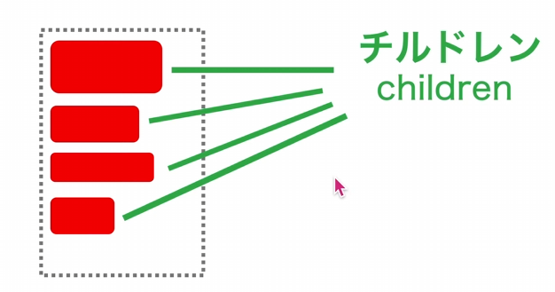
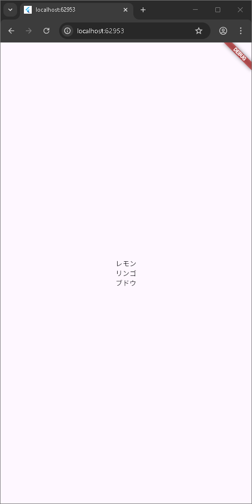

Coulumn_Row編
今回はconst ?? = ??じゃなくて
final ?? = ?? の書き方をする。

Column (カラム)
チルドレンを縦に並べるWidgetです。

cssと似てる
コードと比較
void main() {
  final col = Column(
    mainAxisAlignment: MainAxisAlignment.center,
    crossAxisAlignment: CrossAxisAlignment.center,
    children: [Text("レモン"), Text("リンゴ"), Text("ブドウ")],
  );
  final a = MaterialApp(
    home: Scaffold(body: Center(child: col)),
  );
  runApp(a);
}

row(ロウ)
チルドレンを横に並べる
columnと書き方はあまり変わらなくて、

void main() {
  final col = Row(
    mainAxisAlignment: MainAxisAlignment.center,
    crossAxisAlignment: CrossAxisAlignment.center,
    children: [Text("レモン"), Text("リンゴ"), Text("ブドウ")],
  );
  final a = MaterialApp(
    home: Scaffold(body: Center(child: col)),
  );
  runApp(a);
}

コンパクトにする。