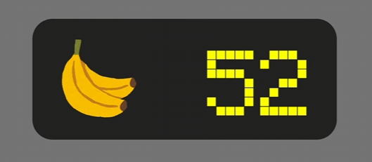

# 05 StatelessWidget の基礎

## 今回作るもの



バナナの画像とカウンターの数字を横並びで表示するWidget。

---

## StatelessWidget とは

状態（データ）が変わらない Widget を作るときに使うクラス。
ボタンを押しても数字が変わらないような、**表示するだけ**のWidgetに使う。

> 状態が変わる（ボタンを押したら数字が増えるなど）場合は `StatefulWidget` を使う。

---

## ファイル構成

```
lib/
├── main.dart                          ← アプリの起点
└── 06_StatelessWidget/
    └── banana_counter.dart            ← 今回作るWidget
```

---

## 書き方

### ① import を書く

```dart
import 'package:flutter/material.dart';
```

### ② stless スニペットで雛形を生成

VSCode で `stless` と入力して選択すると以下が自動生成される。

```dart
class MyWidget extends StatelessWidget {
  const MyWidget({super.key});

  @override
  Widget build(BuildContext context) {
    return const Placeholder();
  }
}
```

- `MyWidget` の部分を自分の Widget 名に変更する（例: `BananaCounter`）
- Widget のコードは `Widget build` の中に書いていく

---

## コード解説

### バナナの画像

```dart
final banana = Image.asset(
  'images/06/banana.png',
  width: 40,
  height: 40,
);
```

### 数字テキスト

```dart
final text = Text(
  '$number',
  style: const TextStyle(
    color: Colors.yellow, // 文字の色
    fontSize: 50,         // 文字の大きさ
  ),
);
```

| プロパティ | 説明 |
|-----------|------|
| `color` | 文字の色 |
| `fontSize` | 文字の大きさ |

### Row で横並びにする

```dart
final row = Row(
  mainAxisAlignment: MainAxisAlignment.spaceBetween,
  children: [
    banana,
    text,
  ],
);
```

> `spaceBetween` → 両端に配置して間を均等に空ける

### Container で装飾する

```dart
final con = Container(
  width: 300,
  height: 100,
  padding: const EdgeInsets.all(12),
  decoration: BoxDecoration(
    color: Colors.black87,
    borderRadius: BorderRadius.circular(12), // 角を丸くする
  ),
  child: row,
);
```

> `color` と `decoration` は同時に使えない。色をつけるときは `decoration` の中の `BoxDecoration` に書く。

### Widget を返す

```dart
return con;
```

---

## Widget の入れ子構造

```
Container（黒・300×100・角丸）
└── Row（spaceBetween）
    ├── Image.asset（バナナ・40×40）
    └── Text（数字・黄色・50px）
```

---

## main.dart での使い方

作った Widget を別ファイルから import して使う。

```dart
import 'package:project/06_StatelessWidget/banana_counter.dart';
```

---

## ポイントまとめ

- `stless` スニペットで StatelessWidget の雛形を素早く作れる
- 表示するだけの Widget は `StatelessWidget` を使う
- `color` と `decoration` は同時に使えない → 色は `BoxDecoration` に書く
- Widget は別ファイルに分けて `import` で呼び出せる