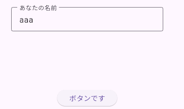
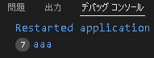

# TextField の基礎

## TextField とは

文字を入力するための Widget。

```dart
final textField = TextField();
```

基本はこれだけで動く。

---

## デコレーション

見た目や補助テキストを設定するには `decoration` プロパティを使う。

```dart
final textField = TextField(
  controller: controller,
  decoration: const InputDecoration(
    border: OutlineInputBorder(),           // 周りに線を引く
    labelText: "あなたの名前",               // 通常時のプレースホルダ
    hintText: "カタカナで入力してください",   // アクティブ時のプレースホルダ
    errorText: null,                        // エラーメッセージ（nullなら非表示）
  ),
);
```

| プロパティ | 説明 |
|-----------|------|
| `border` | 枠線のスタイル。`OutlineInputBorder()` で四角い枠線になる |
| `labelText` | 通常時に表示されるラベル。入力中は上に移動する |
| `hintText` | フォーカスされたときに表示される補足テキスト |
| `errorText` | エラーメッセージを表示する。`null` のときは非表示 |

---

## TextEditingController

入力されたテキストを取得するために使う。

```dart
final controller = TextEditingController();
```

ボタンが押されたときなどに `controller.text` で入力内容を取得できる。

```dart
// 入力内容を取得する
final inputText = controller.text;
debugPrint(inputText);
```

### 実行イメージ




---

## dispose（後片付け）

`TextEditingController` は使い終わったら必ず破棄する必要がある。
破棄しないとメモリリークの原因になる。

```dart
controller.dispose();
```

> `StatefulWidget` を使う場合は `dispose()` メソッドの中で呼び出すのが一般的。

```dart
@override
void dispose() {
  controller.dispose();
  super.dispose();
}
```

---

## コード全体

```dart
import 'package:flutter/material.dart';

void main() {
  final controller = TextEditingController();

  final textField = TextField(
    controller: controller,
    decoration: const InputDecoration(
      border: OutlineInputBorder(),           // 周りに線を引く
      labelText: "あなたの名前",               // 通常時のプレースホルダ
      hintText: "カタカナで入力してください",   // アクティブ時のプレースホルダ
      errorText: null,                        // エラーメッセージ（nullなら非表示）
    ),
  );

  // 関数
  xxxx() {
    // コントローラーから文字を取り出して確認
    debugPrint(controller.text);
  }

  // ボタン
  final button = ElevatedButton(
    onPressed: xxxx, // 関数をボタンに結びつける
    child: const Text('ボタンです'),
  );

  // アプリ
  final app = MaterialApp(
    home: Scaffold(
      body: Center(
        child: Column(
          mainAxisAlignment: MainAxisAlignment.spaceEvenly,
          children: [
            SizedBox(
              width: 300,       // テキストフィールドの横幅を制限
              child: textField,
            ),
            button,
          ],
        ),
      ),
    ),
  );

  runApp(app);
}
```

### Widget の入れ子構造

```
MaterialApp
└── Scaffold
    └── Center
        └── Column（spaceEvenly）
            ├── SizedBox（width: 300）
            │   └── TextField
            └── ElevatedButton
```

---

## ポイントまとめ

- `TextField()` だけで入力欄は作れる
- `InputDecoration` で見た目・ラベル・エラー表示をカスタマイズできる
- 入力内容を取得するには `TextEditingController` が必要
- `controller.text` で入力されたテキストを取得できる
- 使い終わったら必ず `controller.dispose()` で破棄する